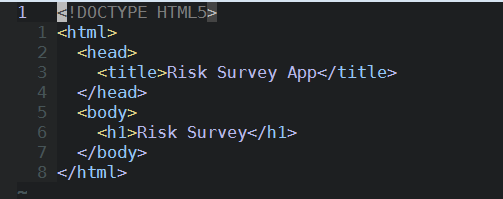

## Deployment Instructions

1. Clone the repository from Azure

```
git clone https://risksurvey_deployment1@risksurveyapp.scm.azurewebsites.net:443/RiskSurveyApp.git
```

2. Input the password for the deployment account

```
Password for 'https://risksurvey_deployment1@risksurveyapp.scm.azurewebsites.net:443': ********************`
```

3. Change directories into the cloned repository

```
cd RiskSurveyApp/
```

4. Make desired changes to files



5. Add and commit your changes

```
git add *
git commit -m "my commit message here"
```

6. Push to Azure to deploy the app

```
git push 
Password for 'https://risksurvey_deployment1@risksurveyapp.scm.azurewebsites.net:443': ********************
```

```
remote: Deployment successful.
To https://risksurveyapp.scm.azurewebsites.net:443/RiskSurveyApp.git
   544ce9f..6648ea4  master -> master
```

